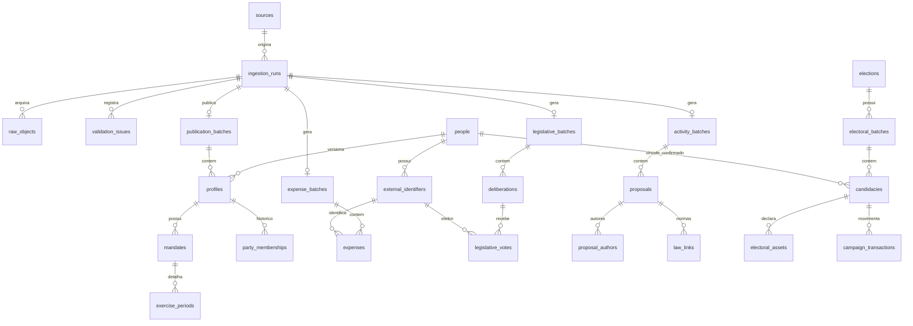

# Guia completo do schema de banco de dados

> Auditoria do modelo existente em 16/09/2026. Fonte canônica: `packages/db/src/migrations.ts`, complementada por `packages/db/src/index.ts`, `packages/db/src/postgres.ts`, `packages/domain/src/index.ts` e `scripts/migrate-sqlite-to-postgres.ts`. Este documento descreve o código atual; não propõe um schema futuro.

## 1. Visão geral

### 1.1 Banco principal e localização

A aplicação usa **SQLite**, por meio do módulo nativo `node:sqlite` e da classe `DatabaseSync`. O arquivo padrão é:

```text
data/senadotracker.sqlite
```

O frontend calcula esse caminho em `apps/web/lib/data.ts` e permite substituí-lo com `SENADOTRACKER_DB_PATH`. O collector abre o mesmo nome dentro do diretório de dados configurado. O SQLite é hoje a base efetivamente consultada pelas funções de `packages/db`; existe suporte de conexão e um script de cópia para PostgreSQL, mas as consultas públicas continuam escritas para `DatabaseSync` e dialeto SQLite.

Ao abrir o banco, `openDatabase()`:

1. habilita chaves estrangeiras;
2. registra a função determinística SQL `search_text()`;
3. define `busy_timeout=5000`;
4. ativa WAL em modo de escrita;
5. cria `schema_migrations` se necessário;
6. aplica, em ordem, as migrações ainda não registradas.

O schema possui **19 migrações versionadas**, **59 tabelas** contando `schema_migrations`, **34 índices explícitos** e **nenhuma view persistida**. Todas as tabelas criadas pelas migrações usam `STRICT`.

### 1.2 Princípio estrutural: fatos imutáveis e publicação ativa

O banco não sobrescreve uma coleta anterior. Cada domínio cria:

- uma execução em `ingestion_runs`;
- evidências brutas em `raw_objects`;
- um cabeçalho de lote, como `expense_batches`;
- registros factuais ligados por `batch_id`;
- um ponteiro em uma tabela `active_*_publications`.

As páginas devem consultar o ponteiro ativo, e não simplesmente o lote mais novo. Assim uma coleta incompleta ou falha não substitui o último conjunto publicado. Trocar o ponteiro é transacional; lotes antigos permanecem disponíveis para auditoria.

Exemplo:

```sql
SELECT e.*
FROM expenses e
JOIN active_expense_publications a ON a.batch_id = e.batch_id
WHERE a.source = 'senado'
  AND a.year = 2026;
```

### 1.3 Convenções de tipos

- Identificadores internos e externos ficam em `TEXT`. IDs oficiais não devem ser convertidos para número sem necessidade.
- Datas civis são textos ISO `YYYY-MM-DD`; timestamps normalmente são ISO 8601.
- Valores financeiros ficam em **centavos inteiros**, com sufixo `_cents`.
- Booleanos SQLite são `INTEGER` com `CHECK (... IN (0,1))`.
- Objetos normalizados completos ficam em `payload TEXT CHECK(json_valid(payload))`.
- `source` usa `senado`, `camara` e, nas tabelas gerais de coleta, também `tse`.
- Ausência é representada com `NULL` ou disponibilidade explícita; nunca se deve inferir zero.
- Chaves compostas quase sempre incluem `batch_id`, preservando versões do mesmo registro em lotes distintos.

### 1.4 JSON: coluna explícita versus `payload`

O modelo é híbrido. Campos usados em integridade, ligação e filtros frequentes são colunas normais. O contrato completo do domínio é preservado em `payload`. Exemplos:

- `profiles` materializa nome, UF, partido e `search_name`, mas guarda todo o `Profile` em `payload`;
- `deliberations` materializa data, ano e IDs, enquanto resultado, órgão, sigilo e proposição ficam no JSON;
- `proposals` mantém quase todo o objeto no JSON; tipo e ano são indexados com expressões `json_extract`;
- itens de enriquecimento recentes materializam `kind`, relações, datas, código, label e URL para evitar reprocessar JSON em consultas comuns.

Alterar a forma de um `payload` exige compatibilidade com os tipos de `packages/domain/src/index.ts` e com consultas `json_extract(...)` existentes.

## 2. Diagrama conceitual



O diagrama é propositalmente resumido. Os ponteiros `active_*`, complementos, presença e gabinetes são descritos nas seções seguintes.

## 3. Controle do schema e da coleta

### 3.1 `schema_migrations`

Criada por `openDatabase()`, fora do array de migrações.

| Coluna | Tipo | Regra |
|---|---|---|
| `version` | INTEGER | chave primária |
| `sha256` | TEXT | hash do SQL da migração |

Antes de aplicar uma migração, o código calcula SHA-256. Se uma versão registrada estiver com outro hash, a abertura falha com **“Migração já aplicada foi alterada”**. Migrações aplicadas são imutáveis; mudanças devem ganhar nova versão.

### 3.2 `sources`

Catálogo de fontes. Colunas: `id` PK e `base_url`. As migrações inserem `senado`, `camara` e `tse`. Todas as famílias de lote usam essa tabela como referência quando aplicável.

### 3.3 `ingestion_runs`

Uma linha por execução do collector.

| Coluna | Significado |
|---|---|
| `id` | UUID da execução, PK |
| `source` | FK para `sources` |
| `started_at`, `finished_at` | início e término |
| `status` | `running`, `validated`, `published` ou `failed` |
| `parser_version` | versão lógica do parser |
| `expected_count` | contagem esperada após reconciliação |
| `roster_complete` | booleano de completude |
| `reconciliation_json` | evidência/resumo de reconciliação |
| `error` | erro final, se houver |

Muitos cabeçalhos de lote reutilizam o mesmo UUID como PK e FK para `ingestion_runs`, impondo relação 1:1 entre execução e aquele lote.

### 3.4 `job_locks`

Lock por fonte: `source` é PK/FK, `run_id` referencia a execução e `expires_at` é epoch em milissegundos. `startRun()` impede duas coletas concorrentes da mesma fonte; `heartbeat()` renova a concessão. Um lock expirado marca a execução antiga como falha.

### 3.5 `raw_objects`

Inventário de toda resposta/arquivo bruto:

`id`, `run_id`, `url`, `fetched_at`, status HTTP, `content_type`, SHA-256 obrigatório com 64 caracteres, `path` local e quantidade não negativa de bytes. Esta tabela é a raiz da proveniência. Quase todo fato publicado contém `raw_id` apontando para ela.

### 3.6 `validation_issues` e `staged_profiles`

`validation_issues` registra erro ou alerta por execução, com `external_id` e `raw_id` opcionais, código e mensagem. `staged_profiles` guarda JSON de perfis antes da publicação, com PK `(run_id, external_id)`. Apenas o pipeline cadastral usa esse staging explícito.

## 4. Identidade parlamentar e cadastro

### 4.1 `people`

Entidade interna independente da Casa: UUID `id` e `created_at`. Ela permite que diferentes identificadores oficiais possam representar a mesma pessoa sem adotar um ID da Câmara ou Senado como chave global.

### 4.2 `external_identifiers`

Mapa `(source, external_id) → person_id`. PK composta por fonte e ID; `source` aceita apenas Senado ou Câmara. Esta chave composta é a referência correta para despesas, votos, presença e gabinete. Um `external_id` isolado não é global.

### 4.3 `identity_links`

Relacionamentos candidatos entre duas pessoas internas: `id`, `person_a`, `person_b`, `status`, `evidence`. Status: `candidate`, `confirmed`, `rejected`, `ambiguous`. Há `CHECK(person_a <> person_b)`. A tabela registra decisão/evidência; não mescla automaticamente as pessoas.

### 4.4 Publicação cadastral

| Tabela | Chave | Papel |
|---|---|---|
| `publication_batches` | `id` | lote cadastral publicado; `id` também referencia `ingestion_runs` |
| `active_publications` | `source` | lote cadastral ativo de cada Casa |
| `profiles` | `(batch_id, person_id)` | snapshot do perfil; também `UNIQUE(batch_id, external_id)` |

`profiles` materializa `external_id`, `name`, `search_name`, `uf`, `party`, `raw_id` e `payload`. `search_name` é nome normalizado para busca sem acentos/caixa. O índice `profiles_filters(batch_id, uf, party, search_name)` atende listagens e facetas.

### 4.5 Histórico cadastral

- `mandates`: PK `(batch_id, person_id, key)`; JSON completo do mandato.
- `exercise_periods`: PK `(batch_id, person_id, key)` e FK `(batch_id, person_id, mandate_key)` para `mandates`; materializa `start` e `end`; valida `end >= start`.
- `party_memberships`: PK `(batch_id, person_id, key)`; materializa início/fim e valida intervalo.
- `history_events`: PK `(batch_id, person_id, key)`; preserva eventos históricos gerais.

Essas tabelas pertencem ao snapshot do perfil. Não se deve combinar linhas de lotes diferentes sem intenção histórica explícita.

## 5. Despesas de cota parlamentar

### 5.1 Cabeçalhos e ativação

`expense_batches` contém fonte, ano entre 2008 e 2100, publicação, `record_count` e `net_cents` agregado. `active_expense_publications` tem PK `(source, year)` e aponta para o lote anual ativo.

### 5.2 `expenses`

Uma linha por lançamento oficial de CEAPS/CEAP.

| Grupo | Colunas |
|---|---|
| Identidade | `batch_id`, `source`, `external_id`, `record_key` |
| Competência | `year`, `month` (1–12), `issued_at` |
| Categoria | `category_code`, `category`, `detail` |
| Fornecedor | `supplier`, `supplier_document` |
| Documento fiscal | `document_number`, `document_id`, `document_url`, `installment` |
| Valores | `gross_cents`, `deduction_cents`, `net_cents`, `refund_cents` |
| Proveniência | `raw_id` |

PK: `(batch_id, record_key)`. FK `(source, external_id)` para `external_identifiers`. O valor usado em painéis costuma ser `net_cents - refund_cents`; o schema não cria coluna derivada. Fornecedor pode ser nulo e documento não é garantido como CNPJ válido.

Índices: por perfil/período, categoria, lote/período/perfil. O radar de fornecedores normaliza e valida CNPJ na consulta; não há tabela mestre de empresas.

## 6. Votações nominais

### 6.1 `legislative_batches` e ativo

Cabeçalho anual por Casa com `deliberation_count` e `vote_count`. `active_legislative_publications` escolhe o lote ativo por `(source, year)`.

### 6.2 `deliberations`

PK `(batch_id, external_id)`. Colunas explícitas: lote, fonte, ID oficial, ano, data, `raw_id` e `payload`.

O JSON segue `Deliberation`:

- fonte, ID e ano;
- `date` e `recordedAt`;
- `chamberBody`;
- descrição;
- resultado literal;
- `approved: boolean | null`;
- `secret`;
- `proposalId`, `proposalLabel`, `proposalSummary`;
- URL oficial e `rawId`.

Uma deliberação é o evento de votação; várias deliberações podem se referir à mesma proposição.

### 6.3 `legislative_votes`

PK `(batch_id, deliberation_id, external_id)`. FKs para a deliberação e para `(source, external_id)` da pessoa. O JSON `LegislativeVote` guarda voto literal, descrição, partido/UF na data, horário e origem.

Esta tabela só conhece votos individualmente publicados. Em votação secreta, o sistema pode conhecer a deliberação sem conhecer a escolha de cada parlamentar. Ausência de linha não prova falta, presença ou voto.

### 6.4 `nominal_deliberations`

Tabela materializada na migração 15 e mantida na publicação. PK/FK `(batch_id, deliberation_id)`. Marca deliberações com ao menos um valor que conta como participação. O conjunto reconhecido inclui Sim, Não, Abstenção, Votou e Secreto; para a Câmara inclui também Obstrução. Evita recalcular o universo nominal em todas as páginas.

Índices cobrem parlamentar, deliberação, voto normalizado, proposição por ID e por label, e lote/data/proposição.

## 7. Proposições e produção legislativa

### 7.1 Lotes de atividade

`activity_batches`: fonte, `scope`, data e contagens de propostas, autores, nomeações e leis. `active_activity_publications` ativa por `(source, scope)`, permitindo vários escopos ativos simultaneamente.

### 7.2 `proposals`

PK `(batch_id, external_id)`; contém fonte, `raw_id`, `grupo_atribuido` e JSON `Proposal`. O payload guarda tipo, grupo funcional em `functionalGroup`, número, ano, label, ementa/resumo, apresentação, situação e URL oficial.

`grupo_atribuido` é calculado deterministicamente a partir da sigla oficial. Ele usa dez chaves estáveis: `proposicoes_legislativas_principais`, `requerimentos`, `emendas_substitutivos`, `pareceres_relatorios`, `instrumentos_votacao_tramitacao`, `indicacoes_sugestoes`, `mensagens_comunicacoes_institucionais`, `oficios_documentos`, `recursos_representacoes_peticoes` e `atos_documentos_especiais`. Siglas não reconhecidas entram no último grupo para nunca deixar o campo nulo. A migração 20 preencheu o acervo anterior; novos lotes são classificados antes da publicação.

Não existe FK global de proposição porque o mesmo ID pode existir em lotes e Casas diferentes. A identidade operacional é fonte + lote + ID.

### 7.3 Relações da proposição

- `proposal_authors`: PK `(batch_id, proposal_id, author_key)`, FK para `proposals`; `person_external_id` é opcional porque autores podem ser órgãos ou atores externos. O JSON traz nome, partido, UF, natureza, autoria principal e ordem.
- `legislative_appointments`: PK `(batch_id, external_id)`; `kind` restrito a `rapporteurship`, `commission`, `office`; liga pessoa, órgão e opcionalmente proposição.
- `law_links`: PK `(batch_id, proposal_id, law_id)`, FK para proposição; preserva norma, URL e tipo de relação.

Índices aceleram autoria por pessoa/proposição e compromissos por pessoa.

## 8. Complementos e enriquecimento de proposições

### 8.1 Complementos genéricos

`complement_batches` é um lote por fonte/escopo, com contagem e JSON de reconciliação. `active_complement_publications` ativa por `(source, scope)`.

`legislative_complements` usa PK `(batch_id, external_key)` e pode ligar um registro a pessoa, proposição, deliberação ou órgão. Materializa `kind`, `occurred_at` e IDs; label, valor e URL ficam no payload `LegislativeComplement`.

Kinds aceitos no domínio incluem: reconciliação, detalhe de matéria/proposição/autor/relator, tema, movimento, situação, relação, documento, norma resultante, emenda, prazo, item de pauta, efeito de voto, voto em comissão, orientação, órgão, membro e liderança.

### 8.2 Enriquecimento materializado

`proposal_enrichment_items` reduz custo de leitura de dados detalhados. Colunas:

`batch_id`, `source`, `proposal_id`, `kind`, `external_key`, `related_proposal_id`, `deliberation_id`, `person_external_id`, `body_id`, `occurred_at`, `code`, `label`, `description`, `official_url`, `inherited_from_proposal_id`, `raw_id`, `payload`.

PK `(batch_id, external_key)`. Índices permitem buscar por proposição, relação, votação e texto normalizado.

`active_proposal_enrichment_publications` ativa um lote por `(source, proposal_id, kind)`. Isso é mais granular que o ponteiro de complementos por escopo: temas, tramitação e documentos da mesma proposição podem ser publicados/atualizados independentemente.

Relações como PEP → projeto principal usam `related_proposal_id` e/ou informação equivalente no payload; `inherited_from_proposal_id` explicita enriquecimento herdado.

## 9. Presença e participação

### 9.1 Presença genérica por sessão

`presence_batches`: fonte, ano, publicação, disponibilidade (`available`, `partial`, `unavailable`), contagens e nota. `active_presence_publications` ativa por `(source, year)`.

`legislative_sessions`: PK `(batch_id, external_id)`, com data, `eligible` booleano, origem opcional e JSON `LegislativeSession` (tipo, status, órgão, início/fim e URL).

`attendance`: PK `(batch_id, session_id, external_id)`, FK para sessão e identidade externa. Materializa `state`; justificativa fica no payload. O índice `attendance_profile` atende série individual.

### 9.2 `chamber_official_presence`

Tabela específica da frequência oficial da Câmara, por deputado e ano. PK `(external_id, year)`.

Colunas: número de sessões, total de dias, dias presentes, justificados e não justificados; `days_json` contém a decomposição diária/mensal; URL, horário de coleta e SHA-256 preservam a evidência. Esta tabela corrige a diferença conceitual entre eventos/sessões e a métrica pública de presença em dias.

Não existe tabela equivalente preenchida para assiduidade oficial do Senado. Participação em votação nominal é armazenada separadamente e não deve ser chamada de presença.

## 10. Eleições, campanha e patrimônio

### 10.1 Eleições e lotes

`elections`: PK `id`, com ano, turno, escopo e URL; `UNIQUE(year, round, scope)`. `electoral_batches` liga uma execução à eleição e registra disponibilidade, contagens de candidaturas, bens, receitas, despesas e nota. `active_electoral_publications` escolhe um lote por eleição.

### 10.2 `candidacies`

PK `(batch_id, sequence_id)`. Materializa `person_id` opcional, `match_status`, ano, UF, cargo, origem e payload. Status: `pending`, `confirmed`, `ambiguous`, `rejected`.

Somente candidatura `confirmed` deve alimentar o perfil de uma pessoa. O JSON guarda eleição, nome civil/urna, número, partido, votos, resultado, eleição, evidências, URLs e detalhes cadastrais.

### 10.3 `electoral_assets`

PK `(batch_id, sequence_id, asset_id, version)` e FK para candidatura. Guarda `value_cents`, origem e JSON com descrição/tipo. `version` preserva retificações sem sobrescrever versões anteriores.

### 10.4 `campaign_transactions`

PK `(batch_id, sequence_id, transaction_id, kind, version)`. `kind` é `revenue` ou `expense`. O payload pode conter contraparte, CPF/CNPJ publicado, categoria, descrição e data; o valor fica materializado em centavos.

O schema suportar a tabela não garante que o lote ativo possua transações. As páginas consultam cobertura antes de publicar financiadores ou despesas de campanha.

## 11. Custos expandidos, equipe e gabinete

### 11.1 `expanded_cost_batches` e `expanded_costs`

Cabeçalho anual por fonte com disponibilidade, nota e contagem; ponteiro ativo por `(source, year)`.

`expanded_costs` tem PK `(batch_id, external_id, competence, rubric)`. `nature` aceita `expense`, `budget`, `occupancy`, `headcount`; `value_cents` pode ser nulo; `overlap_group` marca rubricas potencialmente sobrepostas. O JSON `ExpandedCost` também pode carregar label, contagem e disponibilidade.

Não se deve somar toda linha indiscriminadamente: natureza, rubrica e `overlap_group` definem compatibilidade.

### 11.2 Estrutura antiga de gabinete

- `cabinet_offices`: PK `(batch_id, external_id, office_id)`, localização, observação e payload.
- `cabinet_staff`: PK `(batch_id, external_id, staff_key)`, escritório, função, vigência, observação e payload.

Ambas pertencem ao lote de custo expandido.

### 11.3 Snapshot funcional atual

`staff_snapshot_batches`: snapshot por fonte e `observed_at`, disponibilidade e contagem. `active_staff_snapshot_publications` possui uma linha ativa por fonte.

`functional_staff_assignments` tem PK `(batch_id, staff_key)` e guarda ID funcional opcional, nome, vínculo, cargo, função, unidade, datas, observação, parlamentar associado e evidência no payload. `match_status` aceita `confirmed`, `pending`, `ambiguous`, `rejected`.

Restrição importante:

```text
confirmed  => external_id obrigatório
outro status => external_id obrigatoriamente nulo
```

Logo uma lotação incerta não é atribuída silenciosamente a um gabinete.

### 11.4 Verba mensal da Câmara

`cabinet_budget_batches` só aceita `source='camara'`, ano 2008–2100, disponibilidade e contagem. O ponteiro ativo é `(source, year)`.

`cabinet_monthly_budgets` usa PK `(batch_id, external_id, month)`, materializa ano/mês, `available_cents` e `spent_cents` não negativos ou nulos, além de origem e payload. FK para a identidade externa. Senado não usa esta tabela.

## 12. Valores normativos

`normative_values` guarda regras públicas que não são pagamentos individuais. Colunas: `key`, `kind`, `applies_to`, vigência, `value_cents`, `unit`, base legal, URL, publicação e nota. Valida que o fim não precede o início.

A migração 12 inclui o subsídio parlamentar mensal do Congresso:

| Vigência | Valor bruto mensal |
|---|---:|
| 01/01/2023–31/03/2023 | R$ 39.293,32 |
| 01/04/2023–31/01/2024 | R$ 41.650,92 |
| 01/02/2024–31/01/2025 | R$ 44.008,52 |
| desde 01/02/2025 | R$ 46.366,19 |

Esses valores representam norma publicada, não contracheque, líquido pago ou custo total individual.

## 13. Catálogo completo de tabelas

| Grupo | Tabelas |
|---|---|
| Migração | `schema_migrations` |
| Identidade | `people`, `external_identifiers`, `identity_links` |
| Coleta/auditoria | `sources`, `ingestion_runs`, `job_locks`, `raw_objects`, `validation_issues`, `staged_profiles` |
| Cadastro | `publication_batches`, `active_publications`, `profiles`, `mandates`, `exercise_periods`, `party_memberships`, `history_events` |
| Cota | `expense_batches`, `active_expense_publications`, `expenses` |
| Votações | `legislative_batches`, `active_legislative_publications`, `deliberations`, `legislative_votes`, `nominal_deliberations` |
| Atividade | `activity_batches`, `active_activity_publications`, `proposals`, `proposal_authors`, `legislative_appointments`, `law_links` |
| Presença | `presence_batches`, `active_presence_publications`, `legislative_sessions`, `attendance`, `chamber_official_presence` |
| Complementos | `complement_batches`, `active_complement_publications`, `legislative_complements`, `proposal_enrichment_items`, `active_proposal_enrichment_publications` |
| Eleitoral | `elections`, `electoral_batches`, `active_electoral_publications`, `candidacies`, `electoral_assets`, `campaign_transactions` |
| Custos/gabinetes | `expanded_cost_batches`, `active_expanded_cost_publications`, `expanded_costs`, `cabinet_offices`, `cabinet_staff` |
| Pessoal | `staff_snapshot_batches`, `active_staff_snapshot_publications`, `functional_staff_assignments` |
| Verba Câmara | `cabinet_budget_batches`, `active_cabinet_budget_publications`, `cabinet_monthly_budgets` |
| Normas | `normative_values` |

## 14. Índices explícitos

| Finalidade | Índices |
|---|---|
| Cadastro/brutos | `profiles_filters`, `raw_run` |
| Cota | `expenses_profile_period`, `expenses_category`, `expenses_batch_period` |
| Votos | `legislative_votes_profile`, `legislative_votes_deliberation`, `legislative_votes_choice` |
| Deliberações | `deliberations_proposal`, `deliberations_proposal_label`, `deliberations_batch_date_proposal` |
| Atividade | `proposal_authors_person`, `proposal_authors_proposal`, `appointments_person`, `proposals_listing`, `proposals_batch_presented`, `proposals_batch_status` |
| Presença | `attendance_profile`, `chamber_official_presence_year` |
| Complementos | `complements_profile`, `complements_proposal`, `complements_deliberation` |
| Enriquecimento | `proposal_enrichment_lookup`, `proposal_enrichment_relation`, `proposal_enrichment_vote`, `proposal_enrichment_search`, `active_proposal_enrichment_batch` |
| Eleitoral | `candidacies_person` |
| Gabinete | `functional_staff_office`, `functional_staff_batch_profile`, `expanded_costs_listing`, `cabinet_budget_profile`, `cabinet_budget_batch_profile` |
| Normativo | `normative_values_period` |

Chaves primárias e `UNIQUE` também geram índices internos no SQLite. Não devem ser confundidos com os 34 índices declarados acima.

## 15. Como as principais páginas leem o banco

### Perfis

`profiles` é unido a `active_publications`; histórico vem de seu payload e tabelas filhas. Cota usa `active_expense_publications`; gabinete usa snapshot funcional e custos/verba ativos; votos usam lote legislativo ativo.

### Proposições

Listagem parte de `proposals + active_activity_publications`. Autoria vem de `proposal_authors`. Temas, movimentos, situação e documentos vêm de complementos/enriquecimento ativos. Votações vinculam `deliberations` por `proposalId` e, entre Casas, podem reconciliar label oficial; votos vêm de `legislative_votes`.

### Partidos e estados

Começam no cadastro ativo. Métricas anuais agregam cota, presença, participação, atividade e gabinete somente quando fonte/período/universo são compatíveis. Filiação histórica na data pode ser usada em vez do partido atual.

### Fornecedores

Agrega `expenses` ativas por `supplier_document`, une perfis ativos por `(source, external_id)` e calcula parlamentar, UF, partido, categoria, Casa e mês. Não existe cadastro da Receita Federal no banco.

### Eleições e patrimônio

Somente candidaturas confirmadas ligam `candidacies.person_id` a `people`. Bens e transações usam `(batch_id, sequence_id)`; comparações entre pleitos agregam as declarações de cada eleição, preservando a ressalva de que não são patrimônio atual.

## 16. PostgreSQL

### Configuração

`packages/db/src/postgres.ts` lê:

```text
DB_HOST
DB_PORT
DB_NAME
DB_USER
DB_PASSWORD
DB_POOL_MAX (padrão 10)
DB_SCHEMA (padrão civica)
```

O pool usa timeout de conexão de 5 s, idle de 30 s e configura `search_path` para o schema sanitizado.

### Script de migração

`scripts/migrate-sqlite-to-postgres.ts` copia a estrutura e os dados do SQLite:

1. inspeciona tabelas, colunas, chaves, `UNIQUE`, FKs e índices com PRAGMA;
2. cria as tabelas no schema PostgreSQL;
3. copia linhas em lotes;
4. recria constraints e índices simples;
5. cria a função PostgreSQL equivalente de normalização textual;
6. cria índices PostgreSQL específicos sobre JSON (`payload->>...`).

Índices adicionais no destino: `proposals_label_search_pg`, `proposals_year_type_pg`, `votes_choice_pg` e `deliberations_body_date_pg`.

### Limite atual

A existência do pool e do script não muda automaticamente o runtime. As funções de consulta recebem `DatabaseSync`, usam placeholders `?`, `json_extract`, `instr` e `INDEXED BY`. Portanto a migração atual produz uma cópia PostgreSQL, mas o frontend não passa a consultá-la sem um adaptador/dialeto de leitura.

## 17. Regras de integridade e interpretação

1. Sempre use `source + external_id` para identidades oficiais.
2. Sempre una fatos ao respectivo ponteiro `active_*` para conteúdo publicado.
3. Nunca trate lote existente como lote ativo sem verificar o ponteiro.
4. Nunca altere migração aplicada; acrescente outra versão.
5. Preserve `raw_id`, URL, hash e batch em qualquer dado exibível.
6. Use centavos inteiros; formatação em reais pertence à camada de apresentação.
7. Não some rubricas com `overlap_group` sem regra explícita.
8. Não interprete `NULL` ou indisponibilidade como zero.
9. Voto nominal e presença são universos diferentes.
10. Deliberação secreta não revela escolha individual; uma marca `secreto` não deve virar Sim ou Não.
11. Uma proposição pode ter IDs diferentes em cada Casa e registros acessórios ligados à matéria principal.
12. `match_status` protege vínculos eleitorais e funcionais; só `confirmed` autoriza associação individual.
13. `supplier_document` não é cadastro empresarial; CNPJ precisa ser validado antes de ganhar página pública.
14. Datas textuais devem continuar em formato ISO para ordenação lexical confiável.

## 18. Exemplos de consulta segura

### Perfil ativo

```sql
SELECT p.*
FROM profiles p
JOIN active_publications a ON a.batch_id = p.batch_id
WHERE a.source = 'senado'
  AND p.external_id = ?;
```

### Total líquido de cota no ano

```sql
SELECT SUM(e.net_cents - e.refund_cents) AS total_cents
FROM expenses e
JOIN active_expense_publications a ON a.batch_id = e.batch_id
WHERE a.source = ?
  AND a.year = ?
  AND e.external_id = ?;
```

### Votos publicados de uma pessoa

```sql
SELECT d.date, d.payload AS deliberation, v.payload AS vote
FROM legislative_votes v
JOIN active_legislative_publications a ON a.batch_id = v.batch_id
JOIN deliberations d
  ON d.batch_id = v.batch_id
 AND d.external_id = v.deliberation_id
WHERE a.source = ?
  AND a.year = ?
  AND v.external_id = ?
ORDER BY d.date DESC;
```

### Tramitação ativa de proposição

```sql
SELECT i.*
FROM proposal_enrichment_items i
JOIN active_proposal_enrichment_publications a
  ON a.batch_id = i.batch_id
 AND a.source = i.source
 AND a.proposal_id = i.proposal_id
 AND a.kind = i.kind
WHERE i.source = ?
  AND i.proposal_id = ?
  AND i.kind IN ('movement', 'situation')
ORDER BY i.occurred_at;
```

## 19. Arquivos responsáveis

| Arquivo | Responsabilidade |
|---|---|
| `packages/db/src/migrations.ts` | DDL canônico das 19 migrações |
| `packages/db/src/index.ts` | abertura, migração, transações, publicação e consultas-base |
| `packages/domain/src/index.ts` | contratos TypeScript dos payloads e validações comuns |
| `packages/db/src/propositions.ts` | leitura de proposições, complementos e votações vinculadas |
| `packages/db/src/frontend-data.ts` | composição de perfis para o frontend |
| `packages/db/src/panorama.ts` | panoramas das Casas e operações |
| `packages/db/src/expense-intelligence.ts` | detalhamento e benchmarks de despesas |
| `packages/db/src/investigative.ts` | radar/detalhe de fornecedores e patrimônio |
| `packages/db/src/cabinet-data.ts` | pessoal e verba de gabinete |
| `packages/db/src/participation-series.ts` | séries de presença/participação |
| `packages/db/src/postgres.ts` | configuração do pool PostgreSQL |
| `scripts/migrate-sqlite-to-postgres.ts` | réplica estrutural e de dados para PostgreSQL |

## 20. Checklist do schema

- [x] Todas as 59 tabelas foram inventariadas.
- [x] As 19 migrações e sua proteção por hash foram descritas.
- [x] PKs, FKs, `UNIQUE`, `CHECK` e nulabilidade material foram explicadas por domínio.
- [x] Os 34 índices explícitos foram catalogados.
- [x] O padrão de lotes e ponteiros ativos foi documentado.
- [x] Payloads JSON e contratos TypeScript foram relacionados.
- [x] SQLite e o estado real do suporte PostgreSQL foram diferenciados.
- [x] Proveniência, cobertura e regras contra inferência de zero foram registradas.
- [x] Relações de identidade, proposição, votação, eleição, equipe e custos foram explicadas.
- [x] Não foram inventadas views, triggers ou tabelas inexistentes.
