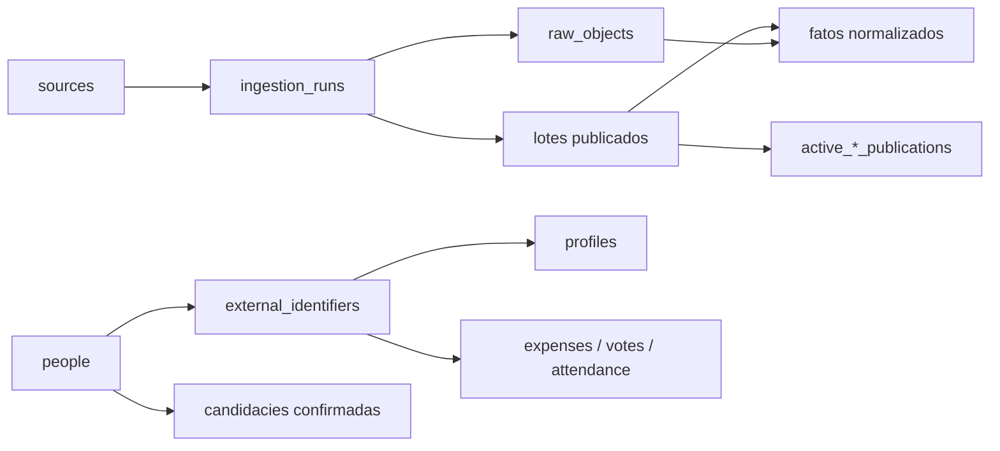

# Schema do banco de dados

Este documento descreve o banco atualmente usado pelo SenadoTracker. A implementação está em SQLite, no arquivo `data/senadotracker.sqlite`, e sua definição canônica está nas migrações de `packages/db/src/migrations.ts`.

## Visão geral

O banco combina quatro ideias centrais:

1. **Identidade interna estável:** uma pessoa possui um `people.id`, enquanto os identificadores oficiais do Senado e da Câmara ficam em `external_identifiers`.
2. **Publicações imutáveis:** cada coleta cria um lote novo. Os registros antigos continuam preservados para auditoria.
3. **Ponteiros para o lote ativo:** tabelas com o prefixo `active_` indicam qual lote deve aparecer na interface.
4. **Colunas estruturais e payload JSON:** campos usados em chaves, filtros, integridade e agregações ficam normalizados; o objeto oficial completo ou normalizado fica em `payload` com validação `json_valid`.

Todas as tabelas são `STRICT`. Chaves estrangeiras são habilitadas ao abrir o banco. Valores monetários são armazenados em **centavos inteiros**, evitando erros de ponto flutuante.



## Convenções de identificação

| Campo | Significado |
| --- | --- |
| `person_id` | Identificador interno e estável de uma pessoa, independente da Casa legislativa. |
| `source` | Origem oficial: `senado`, `camara` ou, nas tabelas aplicáveis, `tse`. |
| `external_id` | Identificador da pessoa ou objeto dentro da fonte oficial. Só é único quando combinado com `source`. |
| `batch_id` | Lote que publicou a observação. Normalmente também é o ID da execução em `ingestion_runs`. |
| `raw_id` | Referência ao objeto bruto que comprova a observação. |
| `payload` | JSON validado contendo o contrato de domínio completo daquele registro. |
| `record_key`, `external_key`, `staff_key` | Chave determinística do registro dentro de um lote. |

Um senador e um deputado podem ter o mesmo `external_id`; por isso, referências externas usam sempre `(source, external_id)`. O `person_id` permite associar a mesma pessoa a diferentes fontes sem confundir os IDs de cada órgão.

## Coleta, auditoria e proveniência

### `sources`

Catálogo das fontes conhecidas. Contém `id` e `base_url`. Atualmente registra Senado, Câmara e TSE.

### `ingestion_runs`

Representa cada execução do coletor.

- `status`: `running`, `validated`, `published` ou `failed`;
- `started_at` e `finished_at`;
- `parser_version`;
- `expected_count` e `roster_complete`;
- `reconciliation_json`, com totais e resultado da conciliação;
- `error`, quando a execução falha.

### `job_locks`

Impede duas coletas concorrentes para a mesma fonte. O lease é ligado à execução e possui `expires_at`.

### `raw_objects`

Inventário dos arquivos e respostas oficiais preservados pelo coletor.

- URL e instante da obtenção;
- status HTTP e content type;
- hash SHA-256;
- caminho do arquivo bruto;
- quantidade de bytes.

Os fatos publicados referenciam `raw_objects.id`, permitindo voltar do dado exibido à evidência recebida.

### `validation_issues`

Registra avisos e erros encontrados durante uma execução, incluindo código, mensagem, identificador externo e objeto bruto relacionado.

### `schema_migrations`

Criada pelo mecanismo de abertura do banco. Guarda versão, hash e data de aplicação de cada migração. O schema atual está na versão **12**.

## Pessoas e cadastro parlamentar

### `normative_values`

Valores fixados por norma, com vigência, unidade, base legal e URL oficial. O subsídio parlamentar usa esta tabela e permanece separado de pagamentos individuais, descontos, ajuda de custo e verbas indenizatórias.

### `people`

Registro mínimo da identidade interna: `id` e `created_at`.

### `external_identifiers`

Relaciona `(source, external_id)` a `people.id`. É a ponte usada por despesas, votos, presença e equipe para chegar à mesma pessoa.

### `identity_links`

Guarda propostas de ligação entre duas pessoas internas, com estado `candidate`, `confirmed`, `rejected` ou `ambiguous` e evidência textual. A tabela impede ligar uma pessoa a ela mesma.

### Cadastro por lote

| Tabela | Função | Chave principal |
| --- | --- | --- |
| `staged_profiles` | Perfis preparados antes da validação e publicação. | `(run_id, external_id)` |
| `publication_batches` | Cabeçalho de uma publicação cadastral. | `id` |
| `active_publications` | Lote cadastral atualmente visível por fonte. | `source` |
| `profiles` | Snapshot do perfil parlamentar, com nome, UF, partido e JSON completo. | `(batch_id, person_id)` |
| `mandates` | Mandatos pertencentes ao perfil daquele lote. | `(batch_id, person_id, key)` |
| `exercise_periods` | Períodos efetivos de exercício ligados a um mandato. | `(batch_id, person_id, key)` |
| `party_memberships` | Intervalos de filiação partidária publicados. | `(batch_id, person_id, key)` |
| `history_events` | Eventos oficiais do histórico parlamentar. | `(batch_id, person_id, key)` |

`profiles` também garante unicidade de `(batch_id, external_id)`. Períodos possuem verificações para impedir uma data final anterior à inicial.

## Gastos de cota parlamentar

| Tabela | Função |
| --- | --- |
| `expense_batches` | Cabeçalho anual do lote, com fonte, ano, quantidade de registros e valor líquido total. |
| `active_expense_publications` | Lote ativo para cada `(source, year)`. |
| `expenses` | Documento ou lançamento individual de CEAPS/CEAP. |

`expenses` contém mês, categoria, fornecedor, documento, datas, parcela, detalhe e valores `gross_cents`, `deduction_cents`, `net_cents` e `refund_cents`. A chave é `(batch_id, record_key)`, e o parlamentar é referenciado por `(source, external_id)`.

Índices principais:

- `expenses_profile_period` em `(source, external_id, year, month)`;
- `expenses_category` em `(batch_id, category_code)`.

## Deliberações, votos e presença

### Votações nominais

| Tabela | Função | Recorte ativo |
| --- | --- | --- |
| `legislative_batches` | Lote anual de deliberações e votos. | — |
| `active_legislative_publications` | Lote ativo por Casa e ano. | `(source, year)` |
| `deliberations` | Evento de votação, matéria, data, órgão e resultado em JSON. | — |
| `legislative_votes` | Voto literal de um parlamentar em uma deliberação. | — |

A chave de uma deliberação é `(batch_id, external_id)`. Um voto usa `(batch_id, deliberation_id, external_id)`, garantindo no máximo um registro por parlamentar naquela deliberação e lote.

O vínculo bicameral de uma proposição não depende de os IDs internos das Casas serem iguais. A consulta tenta o identificador da própria fonte e pode relacionar uma deliberação da outra Casa quando o rótulo oficial de tipo, número e ano coincide, como `PLP 55/2026`.

### Presença

| Tabela | Função |
| --- | --- |
| `presence_batches` | Cobertura anual, disponibilidade, sessões e registros de presença. |
| `active_presence_publications` | Lote ativo por `(source, year)`. |
| `legislative_sessions` | Sessões e indicação de elegibilidade para o denominador. |
| `attendance` | Estado de presença do parlamentar em uma sessão. |

Presença em sessão e participação em votação são calculadas separadamente. A inexistência de voto não cria automaticamente uma ausência.

## Proposições e atividade legislativa

| Tabela | Função |
| --- | --- |
| `activity_batches` | Lote de atividade por fonte e escopo, com contagens de proposições, autores, nomeações e leis. |
| `active_activity_publications` | Lote ativo por `(source, scope)`. |
| `proposals` | Identificação e dados da proposição em `payload`. |
| `proposal_authors` | Autores e coautores, incluindo possível ID parlamentar na fonte. |
| `legislative_appointments` | Relatorias, comissões e cargos, diferenciados por `kind`. |
| `law_links` | Relação explícita entre proposição e norma jurídica. |

Uma proposição é identificada no lote por `(batch_id, external_id)`. Autores usam `(batch_id, proposal_id, author_key)`. Relações com lei não são inferidas a partir da situação textual: precisam existir em `law_links`.

Os índices `proposals_listing` e `deliberations_proposal` usam `json_extract` para acelerar tipo, ano e identificador da matéria sem duplicar esses campos do contrato JSON.

## Complementos legislativos

| Tabela | Função |
| --- | --- |
| `complement_batches` | Lote complementar por fonte e escopo, com reconciliação em JSON. |
| `active_complement_publications` | Lote complementar ativo por `(source, scope)`. |
| `legislative_complements` | Temas, tramitações, situações, orientações, emendas, detalhes e outros fatos complementares. |

Cada complemento pode apontar para uma pessoa, proposição, deliberação ou órgão usando `person_external_id`, `proposal_id`, `deliberation_id` e `body_id`. O campo `kind` determina sua semântica.

## Eleições, campanha e patrimônio declarado

| Tabela | Função |
| --- | --- |
| `elections` | Eleição, ano, turno, escopo e URL oficial. |
| `electoral_batches` | Publicação eleitoral e cobertura de candidaturas, bens, receitas e despesas. |
| `active_electoral_publications` | Lote ativo por eleição. |
| `candidacies` | Candidatura e resultado da conciliação com uma pessoa. |
| `electoral_assets` | Bem declarado, valor e versão. |
| `campaign_transactions` | Receita ou despesa eleitoral, também versionada. |

`candidacies.match_status` pode ser `pending`, `confirmed`, `ambiguous` ou `rejected`. Apenas um vínculo `confirmed` pode preencher `person_id` e aparecer no perfil parlamentar. A publicação exige múltiplas evidências de identidade.

Os bens usam `(batch_id, sequence_id, asset_id, version)`. As transações usam `(batch_id, sequence_id, transaction_id, kind, version)`. A versão faz parte da chave para preservar retificações sem sobrescrever o registro anterior.

Valores de bens e campanha ficam em `value_cents`. Dados pessoais sensíveis presentes nos CSVs brutos não são promovidos às tabelas públicas de consulta.

## Equipes, gabinetes e custos expandidos

### Custos agregados

| Tabela | Função |
| --- | --- |
| `expanded_cost_batches` | Lote anual de custos, orçamento, ocupação ou quantitativos. |
| `active_expanded_cost_publications` | Lote ativo por `(source, year)`. |
| `expanded_costs` | Rubrica por parlamentar e competência. |
| `cabinet_offices` | Escritórios e locais observados. |
| `cabinet_staff` | Estrutura anterior de equipe vinculada ao lote agregado. |

`expanded_costs.nature` distingue `expense`, `budget`, `occupancy` e `headcount`. `overlap_group` permite marcar rubricas que não devem ser somadas indiscriminadamente.

### Snapshot funcional

| Tabela | Função |
| --- | --- |
| `staff_snapshot_batches` | Snapshot de pessoal por fonte e data de observação. |
| `active_staff_snapshot_publications` | Snapshot funcional ativo por fonte. |
| `functional_staff_assignments` | Vínculo funcional, cargo, função, unidade e resultado da correspondência com gabinete. |

Somente linhas com `match_status = 'confirmed'` podem carregar `external_id`. A restrição é aplicada pelo próprio banco.

### Verba mensal de gabinete da Câmara

| Tabela | Função |
| --- | --- |
| `cabinet_budget_batches` | Lote anual da verba de gabinete da Câmara. |
| `active_cabinet_budget_publications` | Lote ativo por ano. |
| `cabinet_monthly_budgets` | Valor disponível e gasto por deputado e mês. |

A chave mensal é `(batch_id, external_id, month)`. `available_cents` e `spent_cents` podem ser nulos quando a fonte não publicou o valor, mas não podem ser negativos.

## Como funciona uma publicação

Uma coleta segue este fluxo:

1. cria uma linha `running` em `ingestion_runs` e adquire `job_locks`;
2. salva cada resposta ou arquivo em `raw_objects`;
3. analisa, normaliza e valida os registros;
4. cria o cabeçalho do lote e os fatos relacionados dentro de uma transação;
5. troca o ponteiro correspondente em `active_*_publications`;
6. marca a execução como `published` e libera o lock.

Se a publicação falhar, a transação é revertida e o lote ativo anterior continua visível. Trocar o ponteiro não apaga os lotes anteriores.

Exemplo simplificado de leitura da publicação ativa:

```sql
SELECT p.*
FROM profiles AS p
JOIN active_publications AS a
  ON a.batch_id = p.batch_id
WHERE a.source = 'senado';
```

Exemplo de despesas anuais publicadas:

```sql
SELECT e.*
FROM expenses AS e
JOIN active_expense_publications AS a
  ON a.batch_id = e.batch_id
WHERE a.source = 'senado'
  AND a.year = 2026
  AND e.external_id = ?;
```

## Relações que exigem atenção

- `external_id` isolado não identifica globalmente uma pessoa; use também `source`.
- Um fato pertencer a um lote não significa que o lote esteja ativo.
- `payload` é parte do contrato de domínio, mas relações e filtros críticos continuam apoiados em colunas e chaves explícitas.
- `availability = 'unavailable'` descreve cobertura da fonte ou do lote e não equivale a valor zero.
- Valores de Casas, períodos ou rubricas diferentes não devem ser somados sem uma regra explícita.
- Proposições equivalentes podem possuir IDs oficiais diferentes no Senado e na Câmara.
- Candidaturas só entram no perfil quando `match_status = 'confirmed'`.
- Snapshots de equipe descrevem uma data de observação, não um histórico completo de permanência.

## Índices atuais

Além dos índices automáticos de chaves primárias e `UNIQUE`, o banco possui:

| Índice | Uso principal |
| --- | --- |
| `profiles_filters` | UF, partido e busca nominal no cadastro ativo. |
| `raw_run` | Objetos brutos de uma execução. |
| `expenses_profile_period` | Gastos por parlamentar e período. |
| `expenses_category` | Agregação de despesas por categoria. |
| `legislative_votes_profile` | Histórico de votos de um parlamentar. |
| `proposal_authors_person` | Proposições ligadas a um autor parlamentar. |
| `appointments_person` | Relatorias, comissões e cargos por parlamentar. |
| `attendance_profile` | Presença por parlamentar. |
| `complements_profile` | Complementos ligados à pessoa. |
| `complements_proposal` | Complementos ligados à proposição. |
| `candidacies_person` | Candidaturas confirmadas consultadas por pessoa e ano. |
| `functional_staff_office` | Equipe por fonte, gabinete, lote e vínculo. |
| `cabinet_budget_profile` | Verba de gabinete por deputado, ano e mês. |
| `proposals_listing` | Filtros de fonte, tipo e ano das proposições. |
| `deliberations_proposal` | Deliberações ligadas ao ID da matéria. |

## Fonte canônica e evolução

O arquivo SQLite é um artefato de execução. Alterações estruturais devem ser feitas acrescentando uma nova migração em `packages/db/src/migrations.ts`, sem editar migrações já aplicadas. O mecanismo compara o hash das migrações existentes e rejeita divergências, protegendo a reprodutibilidade do banco.

As consultas públicas ficam principalmente em:

- `packages/db/src/index.ts`;
- `packages/db/src/propositions.ts`;
- `packages/db/src/frontend-data.ts`;
- `packages/db/src/panorama.ts`;
- `packages/db/src/expense-intelligence.ts`;
- `packages/db/src/states.ts`;
- `packages/db/src/parties.ts`.

---

# SOURCES — Fontes oficiais de dados

Este catálogo reúne as origens conhecidas para coleta. A presença de uma fonte nesta lista não significa que o respectivo dado esteja disponível no lote ativo. O estado efetivo deve ser consultado nos cabeçalhos de lote, nos ponteiros `active_*_publications` e nos campos de cobertura. URLs com identificadores como `{id}`, `{ano}` ou `{competencia}` são modelos de endpoint.

## Senado Federal — cadastro e mandato

| Informação | Fonte oficial | Uso atual |
| --- | --- | --- |
| Senadores em exercício | [Lista atual em JSON](https://legis.senado.leg.br/dadosabertos/senador/lista/atual.json) | Cadastro, identidade, partido, UF, foto e página oficial. |
| Mandatos de um senador | `https://legis.senado.leg.br/dadosabertos/senador/{id}/mandatos.json` | Mandatos, legislaturas, titularidade e suplência. |
| Filiações partidárias | `https://legis.senado.leg.br/dadosabertos/senador/{id}/filiacoes.json` | Histórico partidário com vigência. |
| Senadores e detalhes | [Conjunto de parlamentares](https://www12.senado.leg.br/dados-abertos/legislativo/parlamentares/senadores-em-exercicio) | Referência consolidada para exercício, mandato, filiação, cargos e comissões. |
| Página pública do senador | `https://www25.senado.leg.br/web/senadores/senador/-/perfil/{id}` | Fonte humana de conferência e URL canônica do perfil. |

## Senado Federal — atividade legislativa

| Informação | Fonte oficial | Uso atual |
| --- | --- | --- |
| Votações nominais anuais | `https://legis.senado.leg.br/dadosabertos/dados/ListaVotacoes{ano}.json` | Deliberações, matérias, resultados e votos individuais em Plenário. |
| Votações de um senador | `https://legis.senado.leg.br/dadosabertos/senador/{id}/votacoes.json` | Reconciliação do histórico individual de votos. |
| Catálogo de votações nominais | [Dados Abertos — votações nominais](https://www12.senado.leg.br/dados-abertos/legislativo/plenario/votacoes-nominais) | Documentação e descoberta dos serviços de Plenário. |
| Votações nominais em comissões | `https://legis.senado.leg.br/dadosabertos/votacaoComissao/parlamentar/{id}.json` | Comissão, matéria e voto individual quando publicados. |
| Catálogo de votações em comissões | [Dados Abertos — comissões](https://www12.senado.leg.br/dados-abertos/legislativo/comissoes/votacoes-nominais) | Documentação do serviço. |
| Matéria legislativa | `https://legis.senado.leg.br/dadosabertos/materia/{id}.json` | Identificação, ementa, natureza e detalhes da matéria. |
| Autoria de matéria | `https://legis.senado.leg.br/dadosabertos/materia/autoria/{id}.json` | Autores publicados. |
| Relatorias de matéria | `https://legis.senado.leg.br/dadosabertos/materia/relatorias/{id}.json` | Relatores e períodos publicados. |
| Emendas de matéria | `https://legis.senado.leg.br/dadosabertos/materia/emendas/{id}.json` | Emendas vinculadas. |
| Movimentações | `https://legis.senado.leg.br/dadosabertos/materia/movimentacoes/{id}.json` | Tramitação e eventos legislativos. |
| Situação atual | `https://legis.senado.leg.br/dadosabertos/materia/situacaoatual/{id}.json` | Situação oficial mais recente. |
| Página pública da matéria | `https://www25.senado.leg.br/web/atividade/materias/-/materia/{id}` | Conferência humana e link público. |
| Projetos e matérias | [Catálogo oficial](https://www12.senado.leg.br/dados-abertos/conjuntos?grupo=projetos-e-materias&portal=legislativo) | Descoberta de serviços de autoria, relatoria, tramitação, emendas, situação e vetos. |
| Autorias de um senador | `https://legis.senado.leg.br/dadosabertos/senador/{id}/autorias.json` | Proposições com autoria publicada. |
| Relatorias de um senador | `https://legis.senado.leg.br/dadosabertos/senador/{id}/relatorias.json` | Relatorias explicitamente publicadas. |
| Comissões de um senador | `https://legis.senado.leg.br/dadosabertos/senador/{id}/comissoes.json` | Participação em comissões. |
| Cargos de um senador | `https://legis.senado.leg.br/dadosabertos/senador/{id}/cargos.json` | Cargos e funções parlamentares. |
| Lideranças de um senador | `https://legis.senado.leg.br/dadosabertos/senador/{id}/liderancas.json` | Lideranças partidárias e de blocos. |
| Sessões do Plenário | [Dados Abertos — sessões](https://www12.senado.leg.br/dados-abertos/legislativo/plenario/sessoes-do-plenario/info) | Agenda e resultado de sessões; auxilia a identificar sessões deliberativas. |

## Senado Federal — presença e assiduidade

| Informação | Fonte oficial | Situação |
| --- | --- | --- |
| Registro de Comparecimento e Voto | [Diário do Senado Federal](https://www12.senado.leg.br/assessoria-de-imprensa/tutorial-de-verificacao-da-assiduidade-dos-senadores) | Fonte oficial da presença em sessões deliberativas. Exige localizar e extrair o registro publicado no Diário; ainda não existe coletor estruturado ativo. |
| Missões, licenças e afastamentos | Página individual do senador e relatórios mensais indicados no tutorial de assiduidade | Necessários para separar ausência justificada de falta. Ainda não publicados como métrica no banco. |
| Sessões não deliberativas | Regimento e orientação do Senado | Não possuem lista de presença; não devem entrar no denominador de assiduidade. |

Participação em votação nominal não substitui presença. A futura coleta deve preservar separadamente: presença registrada, ausência justificada, ausência não justificada e voto individual.

## Senado Federal — despesas, gabinete e remuneração

| Informação | Fonte oficial | Uso atual |
| --- | --- | --- |
| Cota parlamentar — CEAPS | `https://www.senado.leg.br/transparencia/LAI/verba/despesa_ceaps_{ano}.csv` | Despesas por senador, fornecedor, documento, categoria, competência e valor. |
| Equipe por gabinete | `https://www6g.senado.leg.br/transparencia/sen/{id}/pessoal/?ano={ano}&local=gabinete&vinculo=TODOS` | Servidores, vínculos, cargos e lotação observados na página do gabinete. |
| Gestão de pessoas | [Catálogo administrativo](https://www12.senado.leg.br/dados-abertos/conjuntos?grupo=gestao-de-pessoas&portal=Administrativo) | Descoberta e validação das bases de pessoal. |
| Remuneração de servidores | [Dados Abertos — remunerações](https://www12.senado.leg.br/dados-abertos/administrativo/gestao-de-pessoas/remuneracoes-de-servidore) | Referência para remuneração individual publicada. |
| Arquivo mensal de remuneração | `https://www.senado.leg.br/transparencia/LAI/secrh/SF_ConsultaRemuneracaoServidoresParlamentares_{AAAAMM}.csv` | Folha por competência e vinculação conservadora ao gabinete. |
| Subsídio e remuneração | [Prestação de contas — remuneração e subsídio](https://www12.senado.leg.br/transparencia/prestacao-de-contas/paginas/remuneracao-e-subsidio-recebidos) | Conferência de subsídio de senador e remuneração de servidores. |

## Câmara dos Deputados — cadastro e mandato

| Informação | Fonte oficial | Uso atual |
| --- | --- | --- |
| API oficial | [Swagger da Câmara](https://dadosabertos.camara.leg.br/swagger/api.html) | Contrato e descoberta dos endpoints REST. |
| Deputados em exercício | `https://dadosabertos.camara.leg.br/api/v2/deputados?itens=100&pagina={pagina}&ordem=ASC&ordenarPor=id` | Cadastro, identidade, partido, UF, foto e paginação. |
| Detalhe de deputado | `https://dadosabertos.camara.leg.br/api/v2/deputados/{id}` | Dados detalhados do perfil. |
| Histórico de deputado | `https://dadosabertos.camara.leg.br/api/v2/deputados/{id}/historico` | Exercício e alterações cadastrais publicadas. |
| Página pública do deputado | `https://www.camara.leg.br/deputados/{id}` | Conferência humana e URL canônica. |

## Câmara dos Deputados — proposições, votações e órgãos

| Informação | Fonte oficial | Uso atual |
| --- | --- | --- |
| Proposições | `https://dadosabertos.camara.leg.br/api/v2/proposicoes` | Busca e listagem de matérias. |
| Detalhe de proposição | `https://dadosabertos.camara.leg.br/api/v2/proposicoes/{id}` | Ementa, apresentação, situação e dados oficiais. |
| Autores | `https://dadosabertos.camara.leg.br/api/v2/proposicoes/{id}/autores` | Autoria publicada. |
| Temas | `https://dadosabertos.camara.leg.br/api/v2/proposicoes/{id}/temas` | Classificação temática oficial. |
| Tramitações | `https://dadosabertos.camara.leg.br/api/v2/proposicoes/{id}/tramitacoes` | Histórico de tramitação. |
| Arquivo anual de proposições | `https://dadosabertos.camara.leg.br/arquivos/proposicoes/json/proposicoes-{ano}.json` | Importação em lote. |
| Arquivo anual de autores | `https://dadosabertos.camara.leg.br/arquivos/proposicoesAutores/json/proposicoesAutores-{ano}.json` | Autoria em lote. |
| Votações | `https://dadosabertos.camara.leg.br/api/v2/votacoes` | Pesquisa de votações. |
| Detalhe de votação | `https://dadosabertos.camara.leg.br/api/v2/votacoes/{id}` | Dados da deliberação. |
| Votos individuais | `https://dadosabertos.camara.leg.br/api/v2/votacoes/{id}/votos` | Voto de cada deputado. |
| Orientações | `https://dadosabertos.camara.leg.br/api/v2/votacoes/{id}/orientacoes` | Orientação de partidos, blocos e Governo. |
| Arquivo anual de votações | `https://dadosabertos.camara.leg.br/arquivos/votacoes/json/votacoes-{ano}.json` | Deliberações em lote. |
| Arquivo anual de votos | `https://dadosabertos.camara.leg.br/arquivos/votacoesVotos/json/votacoesVotos-{ano}.json` | Votos nominais em lote. |
| Órgãos | `https://dadosabertos.camara.leg.br/api/v2/orgaos` | Comissões e outros órgãos. |
| Membros de órgão | `https://dadosabertos.camara.leg.br/api/v2/orgaos/{id}/membros` | Composição de comissões e funções. |
| Arquivo de membros da legislatura | `https://dadosabertos.camara.leg.br/arquivos/orgaosDeputados/json/orgaosDeputados-L{legislatura}.json` | Participação em órgãos em lote. |

## Câmara dos Deputados — presença, despesas e gabinete

| Informação | Fonte oficial | Uso atual |
| --- | --- | --- |
| Eventos anuais | `https://dadosabertos.camara.leg.br/arquivos/eventos/json/eventos-{ano}.json` | Universo de sessões e classificação das sessões deliberativas encerradas. |
| Presença em eventos | `https://dadosabertos.camara.leg.br/arquivos/eventosPresencaDeputados/json/eventosPresencaDeputados-{ano}.json` | Presença individual dos deputados. |
| Cota parlamentar — CEAP | `https://www.camara.leg.br/cotas/Ano-{ano}.json.zip` | Despesas, fornecedores, documentos, categorias, valores e estornos. |
| Funcionários | [Arquivo consolidado](https://dadosabertos.camara.leg.br/arquivos/funcionarios/csv/funcionarios.csv) | Equipe e lotação publicadas pela Câmara. |
| Verba de gabinete | `https://www.camara.leg.br/deputados/{id}/verba-gabinete?ano={ano}` | Limite e utilização mensal da verba por deputado. |

## Tribunal Superior Eleitoral — eleições, campanha e patrimônio

| Informação | Fonte oficial | Uso atual |
| --- | --- | --- |
| Portal de Dados Abertos | [Dados Abertos do TSE](https://dadosabertos.tse.jus.br/) | Catálogo oficial dos lotes eleitorais. Pode responder com bloqueio de CDN dependendo do ambiente. |
| Candidatos | `https://cdn.tse.jus.br/estatistica/sead/odsele/consulta_cand/consulta_cand_{ano}.zip` | Candidatura, cargo, partido, situação e identificador do candidato. Importação depende de arquivo local validado quando o CDN bloqueia o ambiente. |
| Página do conjunto de candidatos | `https://dadosabertos.tse.jus.br/dataset/candidatos-{ano}` | Proveniência do lote cadastral eleitoral. |
| Bens declarados | `https://dadosabertos.tse.jus.br/dataset/bens-de-candidatos-{ano}` | Patrimônio declarado por candidatura e comparação nominal entre pleitos. |
| Resultados eleitorais | [Resultados do TSE](https://resultados.tse.jus.br/) | Votos e resultado oficial por candidatura quando integrados ao lote. |
| Prestação de contas eleitorais | Conjuntos anuais de receitas e despesas de candidatos no Portal de Dados Abertos do TSE | Financiadores, fornecedores e transações de campanha. O schema e o parser existem, mas o banco atual ainda não possui `campaign_transactions` publicados. |

Os vínculos entre candidatura e parlamentar só são publicados quando `match_status = 'confirmed'`. Nome isolado não confirma identidade. Valores patrimoniais são declarações de pleitos específicos e não representam patrimônio atual nem, isoladamente, enriquecimento.

## Base normativa do Congresso Nacional

| Informação | Fonte oficial | Uso atual |
| --- | --- | --- |
| Subsídio de deputados e senadores | [Decreto Legislativo nº 172/2022](https://www2.camara.leg.br/legin/fed/decleg/2022/decretolegislativo-172-21-dezembro-2022-793529-norma-pl.html) | Série de valores normativos brutos mensais armazenada em `normative_values`. Não representa pagamento líquido individual. |

## Fontes auxiliares de interface

| Recurso | Origem | Uso |
| --- | --- | --- |
| Logotipos partidários | Arquivos oficiais ou institucionais preservados em `apps/web/public/parties/` | Identificação visual; não são fonte para filiação ou composição parlamentar. |
| Mapa vetorial do Brasil | [Mapa do Brasil SVG](https://github.com/LucasBassetti/mapa-brasil-svg), códigos territoriais do IBGE, licença MIT preservada em `apps/web/public/licenses/mapa-brasil-svg.txt` | Navegação visual por UF; não fornece métricas legislativas. |

## Regras comuns de coleta

- Aceitar somente HTTPS e domínios oficiais previstos para a fonte.
- Arquivar a resposta original em `raw_objects` antes da normalização.
- Preservar URL, horário de coleta, status HTTP, tipo de conteúdo, tamanho, hash SHA-256 e caminho do bruto.
- Não interpretar HTTP 403, HTML de bloqueio, timeout ou arquivo ausente como conjunto vazio.
- Não substituir ausência de presença por ausência de voto, nem ausência de registro financeiro por valor zero.
- Publicar um novo lote somente após validação e reconciliação; em falha, manter o lote ativo anterior.
- Exibir período, cobertura, tamanho da amostra e origem junto às métricas derivadas.
